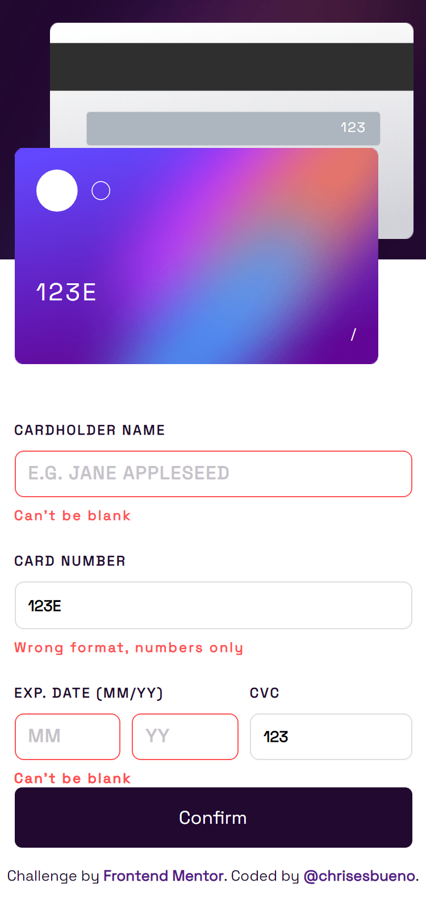

# Frontend Mentor - Interactive card details form solution

This is a solution to the [Interactive card details form challenge on Frontend Mentor](https://www.frontendmentor.io/challenges/interactive-card-details-form-XpS8cKZDWw). Frontend Mentor challenges help you improve your coding skills by building realistic projects. 

## Table of contents

- [Overview](#overview)
  - [The challenge](#the-challenge)
  - [Screenshot](#screenshot)
  - [Links](#links)
- [My process](#my-process)
  - [Built with](#built-with)
  - [What I learned](#what-i-learned)
- [Author](#author)

## Overview

### The challenge

Users should be able to:

- Fill in the form and see the card details update in real-time
- Receive error messages when the form is submitted if:
  - Any input field is empty
  - The card number, expiry date, or CVC fields are in the wrong format
- View the optimal layout depending on their device's screen size
- See hover, active, and focus states for interactive elements on the page

### Screenshot




### Links

- Solution URL: [Add solution URL here](https://www.frontendmentor.io/solutions/interactive-card-datails-form-rVj1_vc6r9)
- Live Site URL: [Add live site URL here](https://chrisesbueno.github.io/interactive-card/)

## My process

### Built with

- Semantic HTML5 markup
- CSS custom properties
- Flexbox
- CSS Grid
- Mobile-first workflow

### What I learned


```js
function verified(input, number, n) {

    /* Remove spaces */
    let cardnumber = number.split(' ').join('')

    /* Limited value length input */
    input.value = input.value.slice(0, n) 

    /* Style show for when requirements are met */
    if (!Number(cardnumber)) {
        input.parentElement.classList.add('show')
    } else {
        input.parentElement.classList.remove('show')
    }
    if (number.length == 0){
        input.parentElement.classList.remove('show')
    }
    
    return cardnumber
}
```

## Author

- Frontend Mentor - [@chrisesbueno](https://www.frontendmentor.io/profile/chrisesbueno)
- Twitter - [@chrisesbueno](https://www.twitter.com/chrisesbueno)
